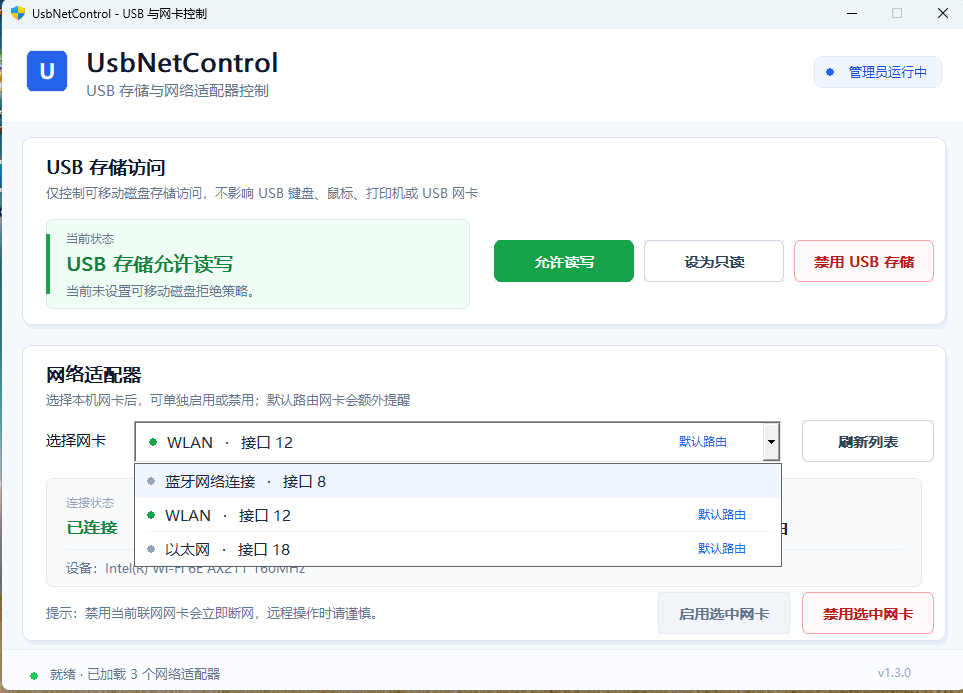

# UsbNetControl

轻量、开源的 Windows 10/11 图形化工具，用于管理 **USB 存储访问** 与 **本机网络适配器**。



## 功能

- USB 存储：允许读写 / 只读 / 禁用
- 只控制可移动存储，不影响 USB 键盘、鼠标、打印机或 USB 网卡
- 自动识别当前实际使用的网络适配器
- 列出本机网络适配器，并可启用 / 禁用选中网卡
- 默认路由网卡禁用前额外警告
- 启动时自动请求管理员权限；拒绝 UAC 时退出
- 原生 Windows GUI，单文件 EXE
- 不安装驱动、不常驻、不联网
- MIT License

## 下载

推荐从 GitHub Releases 下载对应架构：

- `UsbNetControl-vX.Y.Z-win-x64.exe`：普通 Intel / AMD Windows 电脑
- `UsbNetControl-vX.Y.Z-win-arm64.exe`：Windows ARM64 设备

每个 Release 同时提供 ZIP 与 `SHA256SUMS.txt`。

> 当前发布版在 SignPath Foundation 申请获批前仍可能是未签名版本，因此 Windows UAC / SmartScreen 可能显示“未知发布者”。GitHub Release 和 Artifact Attestation 可以证明构建来源，但不会替代 Windows Authenticode 代码签名。

## Code signing policy

本项目正在准备使用 SignPath Foundation 的开源代码签名流程。完整策略见 [CODE_SIGNING.md](CODE_SIGNING.md)，隐私说明见 [PRIVACY.md](PRIVACY.md)。

Free code signing provided by SignPath.io, certificate by SignPath Foundation.

本程序不包含遥测、广告或自动联网功能。正式启用 SignPath 后，官方 Windows Release 将由 GitHub Actions 从本仓库源码构建，经 SignPath 验证构建来源并进行 Authenticode 签名。

## 使用

1. 下载与你系统架构对应的 EXE。
2. 双击运行。
3. 接受 Windows UAC 管理员权限提示。
4. 在界面中控制 USB 存储策略或选择网卡进行启用 / 禁用。

### USB 存储模式

- **允许读写**：恢复可移动磁盘读写权限。
- **设为只读**：允许读取，禁止写入。
- **禁用 USB 存储**：禁止可移动磁盘读取和写入。

USB 策略修改后，已经插入的 U 盘或移动硬盘建议重新插拔一次。

### 网络适配器

程序启动和点击“刷新列表”时，会优先选择 Windows 当前实际使用的网络适配器。多条默认路由并存时，会优先选择已连接且路由指标更优的适配器。

> 禁用当前联网网卡会立即断网。通过远程桌面、SSH 或其他远程方式操作时请特别谨慎。

## 实现方式

USB 存储访问通过 Windows Registry API 管理：

```text
HKLM\SOFTWARE\Policies\Microsoft\Windows\RemovableStorageDevices
```

网络适配器枚举和启停使用 Windows 自带 PowerShell：

```powershell
Get-NetAdapter
Enable-NetAdapter
Disable-NetAdapter
```

项目不依赖第三方运行库或 PowerShell 模块。

## 从源码编译

需要 Go 1.23 或更高版本。

Windows 下可直接运行：

```cmd
build.cmd
```

也可以手动构建 x64：

```bash
GOOS=windows GOARCH=amd64 CGO_ENABLED=0 go build -trimpath -ldflags="-H=windowsgui -s -w" -o UsbNetControl.exe .
```

## 自动发布

仓库包含 GitHub Actions：

- `CI`：push / pull request 时交叉编译 x64 和 ARM64，确认代码可构建。
- `Release`：推送 `v*` Tag 后自动生成 x64 / ARM64 EXE、ZIP、SHA256，并创建 GitHub Release。
- Release 工作流同时生成 GitHub Artifact Attestation，用于验证二进制构建来源。

例如发布 `v1.3.1`：

```bash
git tag v1.3.1
git push origin v1.3.1
```

验证 GitHub 构建来源：

```bash
gh attestation verify UsbNetControl-v1.3.1-win-x64.exe -R datout/UsbNetControl
```

## 安全说明

- 软件需要管理员权限，因为 USB 策略和网卡状态均属于系统级设置。
- 本项目不会主动联网，也不会收集或上传数据。
- 如果系统、域策略或安全软件已经设置更高优先级的设备限制，本工具不会尝试绕过这些限制。
- 请勿在不了解后果的情况下禁用当前远程连接所依赖的网卡。

## License

[MIT License](LICENSE)
